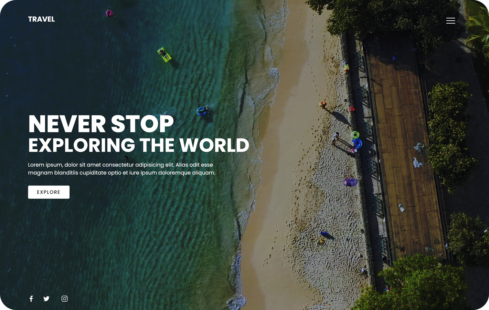

# Travel Landing

## Description

Hey there, welcome to our awesome Travel website's landing page! We've spiced it up with some serious flair. When you visit, you'll be greeted by a mesmerizing video background that whisks you away to fantastic destinations. We've added a slick color overlay for that touch of intrigue - trust us, it's a game-changer.

But that's not all. We've sprinkled in some cool CSS animations, not just on our social icons but also on the main "Let's Explore" button. They're not just animations; they're good vibes.

To keep things smooth and easy, we've designed a responsive menu that dances to the left with grace. It's so fluid that you'll feel like you're floating on a cloud as you explore our fantastic travel options, no matter what device you're on.

Get ready to dive into an epic adventure because travel just got a whole lot cooler. So, kick back, explore, and let's make memories!

## Live Demo

You can experience Travel Landing and explore by visiting the live demo [Live Demo](https://codenaud.github.io/travel-landing/)

## Features

- **Video Background:** Our landing page captivates your attention with a stunning video background that transports you to your dream destinations.

- **Elegant Overlay:** We've added a sleek color overlay that adds a touch of mystique to your browsing experience.

- **CSS Animations:** Enjoy the delightful CSS animations that bring life to our social icons and the main "Let's Explore" button.

- **Responsive Menu:** Our menu elegantly slides to the left, creating a seamless mobile experience, and it's as smooth as a velvet glove.

## Technologies Used

Travel Landing project has been developed using the following technologies:

- HTML5: HTML5 structures and organizes our content, making it look great on the web.
- CSS3: CSS3 is responsible for the fantastic styles and visual effects that make our page pop.
- JavaScript: A dash of JavaScript adds that extra flair, making interactions smooth and engaging.
- Code Editor: Our code is crafted with love in a dedicated code editor, ensuring clean and efficient code that makes your experience even better.

## Badges/Shields

Dev Skills

Build with

## Acknowledgments

This project would not have been possible without the incredible community of developers and designers who continually inspire and support each other.

To make this application I have used several resources that I share below.

---

    - Traversy Media
    - Youtube: [URL](https://youtu.be/HtunPQtr-Xw?si=n1w4QUPmKkTiWUYL)

    --> @TraversyMedia

---

## About Me

I'm a junior frontend developer passionate about HTML, CSS and JavaScript, who wants to share the work of all the people who have helped me on the way to being able to dedicate myself to what I like the most.

## Contact

If you have any questions or suggestions, do not hesitate to contact me through my email: [codenaud@gmail.com](mailto:codenaud@gmail.com)

Happy coding! 🚀
